# ABC WOD

## Purpose
ABC WOD is a website for people who workout and need inspiration for their next workout (or Workout of the day - WOD). Any user can view workouts, but only registered users can add workouts. Authors of workouts are also able to edit and delete their posts.

A full list of technologies used can be found in the technologies section of this document. Note that GitHub as of March 2021 automatically creates a Table of Contents for the README file.

## ABC WOD Responsive Website

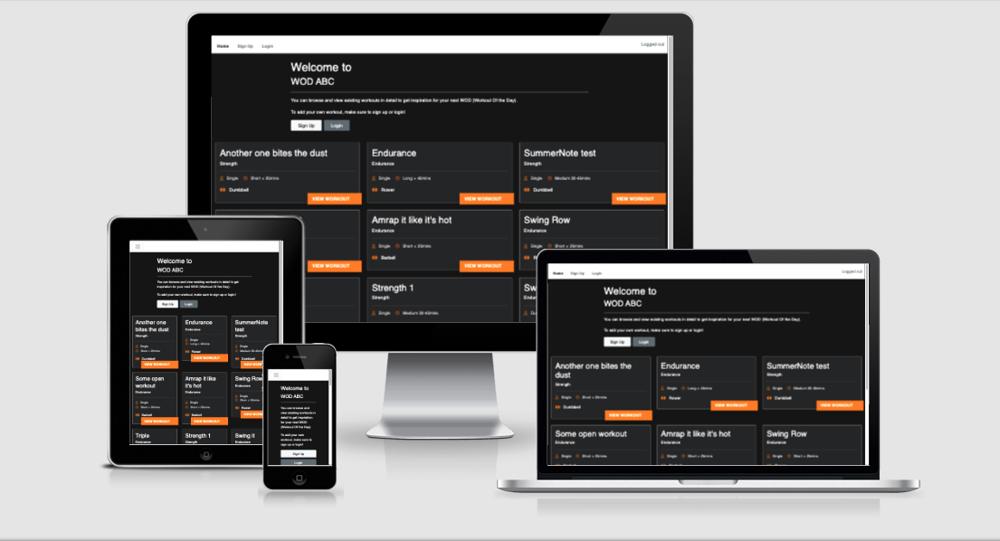


[Link to deployed site](https://wod-abc.herokuapp.com/)

## UX

This website was created to showcase my knowledge in Fullstack Development and to provide users with a place to view, create, update and remove Workouts of their own as well as view those created by others.

### User Stories:

Github issues were used to record the user stories. Stories were categorized into different priorities: “Must have”, “Should Have” and “Could Have”.

#### Site administrator:

- As a site admin I can manage site content so that admin remains in control of the site

#### New users:

- As a site user I can view summary content so that I can find inspiration
- As a site user I can register an account so that I can access the full features of the site
- As a site user I can login to the website so that I can use the site´s full functionalities
- As a logged in site user I can add new workouts so that I and other site users can view them
- As a logged in user I can view workout details so that all information is available to me
- As a logged in site user I can edit my workouts so that they can be updated as needed
- As a logged in site user I can delete my workouts so that they can be permanently removed if no longer needed
- As a logged in site user I can logout so that my account and contributions are protected
- As a logged in user, I can use a “What you see is what you get” for formatting text so that it visually displays as expected


#### Could haves (not implemented yet)
- As a logged in site user I can search and filter the content so that I can find a workout that suits my preferences
- As a logged in site user I can add workouts to a favorite´s list so that I can easily revisit them
- As a site user I can use social media to login so that I don't have to create a new account

### Wireframes

Wireframes were created with Balsamiq and are uploaded to a separate folder - [View](https://github.com/CeciliaSwe/portfolio-4th/tree/main/assets/wireframes_responsive/P4_workout_wireframes_responsive.pdf). The project was developed from the initial wireframes and some modifications were made during the development process for improved usability and user experience.

### Design

#### Imagery

No physical images will be used on the site. It does make use of Font Awesome icons for visual enhancement.

#### Typography

The font used for my website is "Murecho". The font is provided by Google Fonts.

#### Colour scheme

I chose a dark theme with backgrounds (overall background and card background) in 2 dark shades and a font in white. A bright orange is used for details for contrast.

#### Model

An initial model was created with and is uploaded to a separate folder - [View](https://github.com/CeciliaSwe/portfolio-4th/tree/main/assets/wireframes_responsive/workout_table.png)
The final model has minor changes (such as field type) for usability purposes, but the overall structure has been adhered to.

#### Agile Methodology

Github Issues were used to create User Stories and group them according to MoSCoW prioritization technique. GitHub Projects and Kanban board was used to visualize and execute the agile methodology. The issues are currently in two categories: “Done” and “For next release”.


## Features

### Existing Features

#### Navbar and footer

- Navbar and footer are using Bootstrap components and are adjusted to the needs of the project.


##### Home page

- Home page consists of a Welcome Hero with a short message with buttons to Sign up/Login or Add Workout (depending on the user login status).


- Second part of the home page is the list of workouts. The list is generated dynamically as per most current workouts first. The page paginated at 9 workouts and will at that point display Next / Prev buttons to navigate to next and previous pages.


#### Workout full

- Clicking "View Workout" will take the user to the full Workout where the full contents is displayed.


- If user is the author of the workout, edit and delete icons will display at the bottom if the workout card to allow user to edit workout or delete workout.


#### Add Workout / Edit

- Add Workout button is displayed for logged in users and takes the user to custom form where all fields are required. The content field is a SummerNote WYSIWYG which allows user to customize the visual appearance of the content.

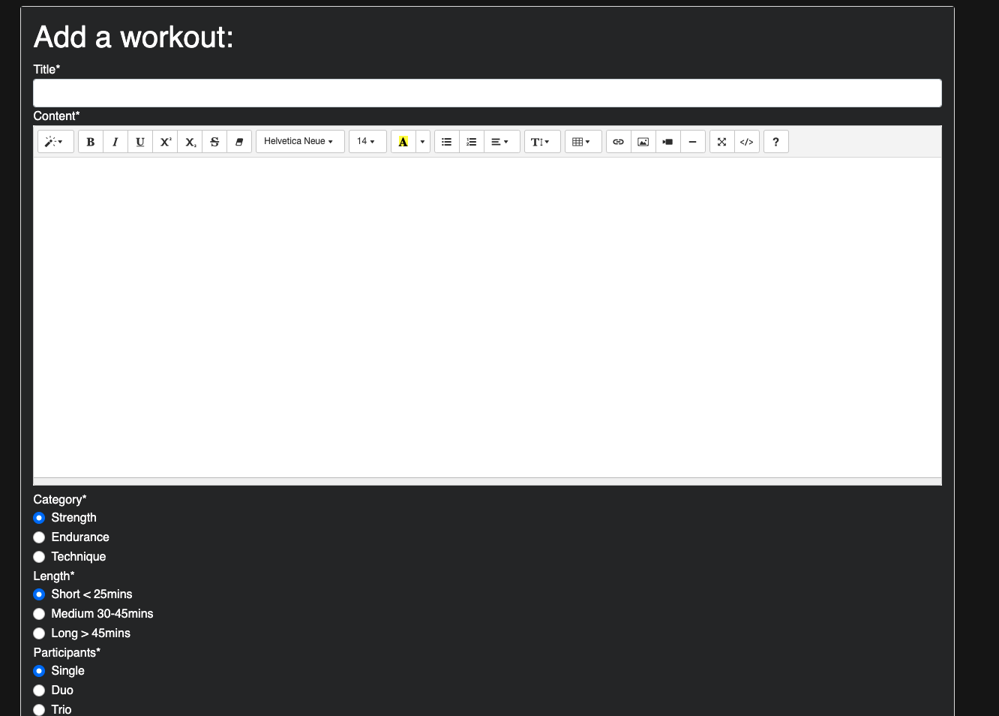

- Submitting a valid form will redirect user back to the homepage and the newly added workout is displayed first. A success message is displayed and automatically closed after 3,5 seconds.

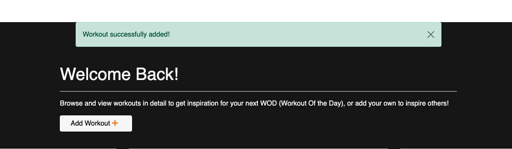

- - If the user does not fill out the title field, the form will not submit and the title field is highlighted. If the user does to fill out any content, the form will reload blank and an error message is displayed and automatically closed after 3,5 seconds.

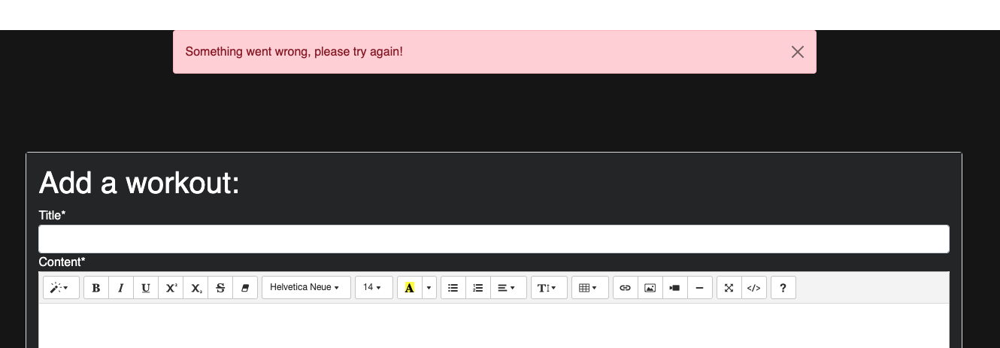

The Edit form is identical to the Add form, but is pre-populated with the current contents.

#### Delete Workout

- If user us the author of a workout, a delete icon will be displayed when viewing the full workout. Clicking the delete icon prompts a Delete Modal, asking "Are you sure you want to delete this workout?". Chosing "Close" will close the modal without action.

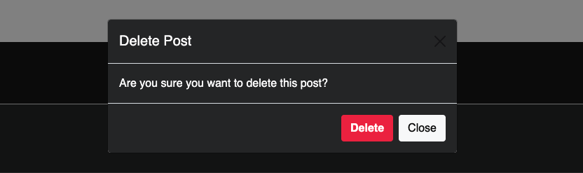

- Chosing "Delete" will delete the workout permanently and display a message to the user that the Workout has been deleted. The message will be automatically closed after 3,5 seconds.

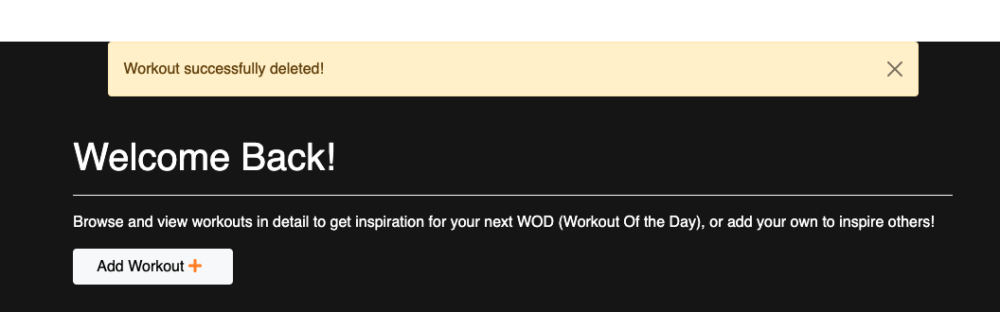

#### Signup / Login / Logout

- Users can signup to gain access to all features (i.e. ability to add, edit and delete their own Workouts).

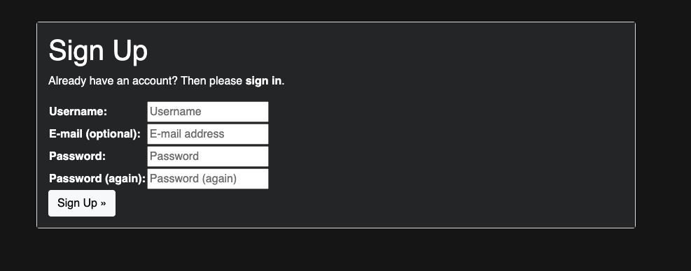

- Once an account is created, users can login and logout and are notified by messages when signing in and out.

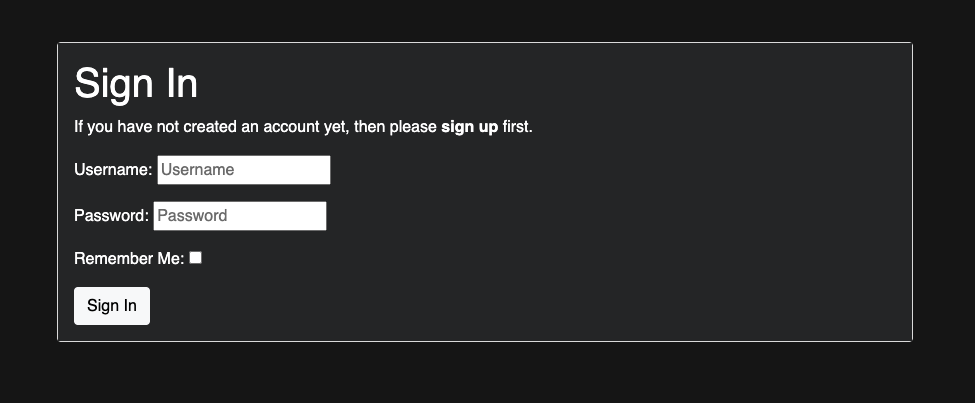
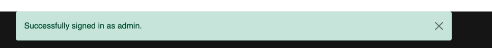
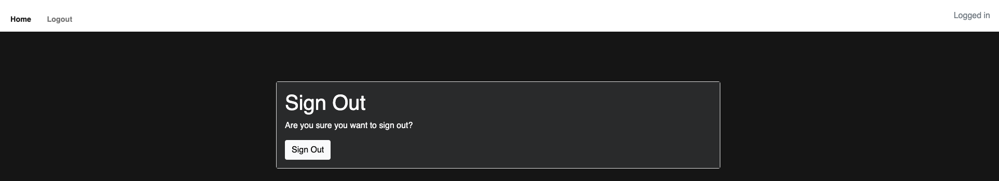
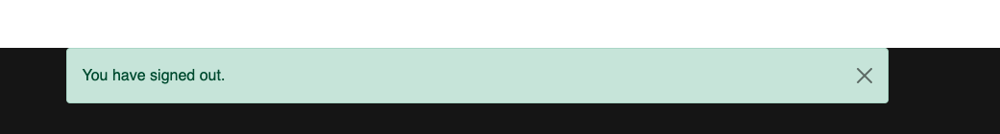


### Features Left to Implement

- Allow users to filter for category, length and number of participants
- Allow users to add favorite workouts to revisit later
- Allow user to login via social media

##### Return to [top](#abc-wod)

## Technologies Used

### Languages

* HTML5
	* This project uses HTML5 as the main language for content and structure of the Website.
* CSS3
	* This project uses CSS3 for Website styling
* Javascript
	*  This project uses Javascript for the required logic to allow for interactivity
* Python
	* Back-end language that the Django framework is based on

### Frameworks, Libraries and Programs used

* [Django](https://www.djangoproject.com/)
	* High-level Python web framework used to build this application
* [Bootstrap](https://getbootstrap.com/)
	* For components and styling
* [Font Awesome](https://fontawesome.com/)
	* Font awesome Icons are used
* [Google Fonts](https://fonts.google.com/)
	* Google fonts are used throughout the project to import the relevant fonts
* [GitHub](https://github.com/)
	* GithHub is the hosting site used to store the source code for the Website and [Git Pages](https://pages.github.com/) is used for the deployment of the live site.
* [GitPod](https://gitpod.io/)
	* GitPod is used as version control software to commit and push code to the GitHub repository where the source code is stored.
* [Google Chrome Developer Tools](https://developers.google.com/web/tools/chrome-devtools)
	* Google chromes built in developer tools are used to inspect page elements and help debug issues with the site layout and test different CSS styles.
* [Balsamiq Wireframes](https://balsamiq.com/wireframes/)
	* Balsamiq was used to create wireframes and UX design during the planning and design process.
* [Am I Responsive?](http://ami.responsivedesign.is/)
	* Used to generate the screenshots for responsive design.
* [Heroku](https://dashboard.heroku.com/)
	* Could application platform where the deployed application is served from
* [Cloudinary](https://cloudinary.com/)
	* Could application platform where the deployed application is served from
* Heroku Postgres
    * PostgreSQL is one of the world's most popular relational database management systems.


##### Return to [top](#abc-wod)

## Testing

Owing to time constraints, it was not possible to design and implement automatic Unit-testing for this project, and so extensive manual testing was completed instead.
An MS Excel workbook detailing these tests and outcomes can be found [here](https://github.com/CeciliaSwe/portfolio-4th/tree/main/assets/testing/page_tests_portfolio4th.xlsx)

### Bugs

#### Resolved Bugs

- add_items page would not render (could not find path even though it was added correctly to urls). Solved by rearranging order of url paths.
- SummerNote WYSIWYG only displaying in Admin panel and not in front end form. Solved by adding SummerNote settings to settings.py
- SummerNote for in front end form overflowing its div on medium and smaller screens. Solved by adding additional SummerNote settings to settings.py
- Unable to add Workout due to form validation. Solved by (1) add Slugify to generate the slug when adding Workout through the front end form (in addition to it being autogenerated in the Admin panel) and (2) replace Multiselect widget with Radio Buttons.
- HTML validation errors on specific pages if user is logged out. Solved by moving the applicable if statement before the opening div instead of after.
- Signing up using an email address generated a "500 server error". Resolved by updating settings.py with account email verification to optional.

#### Unresolved bugs

- If a user adds a Workout and select a full line, selects a style and then applies a different style to part of that line, this will generate HTML validation errors (as - for example - this can cause a h5 element can become nested inside a h4 element).


### Validation

#### HTML valiation

HTML pages have been validated through the [HTML validator](https://validator.w3.org/nu/#textarea) without errors.
(Exception: the SummerNote Widget generates validation errors on the add_item and edit_item pages, but as this is build into the Widget and cannot be changed, it is disregarded as errors for the purpose of this Portfolio Project).
A copy of the HTML reports can be found [here](assets/validation/html)


#### CSS validation

No errors were found when passing through the official [W3C validator](https://jigsaw.w3.org/css-validator/). A copy of the report can be found [here](assets/validation/css/validation_css.pdf)

#### JavaScript validation
Javascript code validation was complited on [jshint](https://jshint.com/) without errors.

A copy of the report can be found [here](assets/validation/js/validation_js.pdf)


#### Python validaton

The Python pages have been validated though the PEP8 validator. Copies of the reports can be found [here](assets/validation/python)


##### Return to [top](#abc-wod)

## Deployment

### Initial Deployment to Heroku

**In your app / GitPod**

1. Create new repository from CI template
2. Install Django and required dependencies into Gitpod workspace
3. Create new Django project called "wodabc" and app called "wod"
4. Create Procfile as required
5. Run "pip3 freeze --local > requirements.txt" to update requirements file
6. Git add and git commit the changes made


**Log into heroku**

3. Log into [Heroku](https://dashboard.heroku.com/apps) or create a new account and log in
4. top right-hand corner click "New" and choose the option Create new app, if you are a new user, the "Create new app" button will appear in the middle of the screen
5. Write app name - it has to be unique, it cannot be the same as this app
6. Choose Region - I am in Europe
7. Click "Create App"


**Add Postgres and set Config Vars**

8. Go to Resources Tab, Add-ons, search and add Heroku Postgres
9. Choose "settings" from the menu on the top of the page
10. Go to section "Config Vars" and click button "Reveal Config Vars".
11. Add the below variables to the list
    * Database URL will be added automaticaly
    * Secret_key - is the Django key
    * Cloudinary URL can be obtained from [cloudinary](https://cloudinary.com/) follow the steps on the website to register.
    * Configure "DISABLE_COLLECTSTATIC = 1" in Config Vars


**GitPod/GitHub**

12. Procfile needs to be created in your app
```
web: gunicorn PROJ_NAME.wsgi
```

13. In settings in your app add Heroku to ALLOWED_HOSTS
14. Add and commit the changes in your code and push to github


**Final step - deployment**

15. Next go to "Deploy" in the menu bar on the top
16. Go to section "deployment method", choose "GitHub"
17. New section will appear "Connect to GitHub" - Search for the repository to connect to
18. Type the name of your repository and click "search"
19. Once Heroku finds your repository - click "connect"
20. Scroll down to the section "Automatic Deploys"
21. Click "Enable automatic deploys" or choose "Deploy branch" and manually deploy
22. Click "Deploy branch"

Once the program runs:
you should see the message "the app was sussesfully deployed"

23. Click the button "View"


### Final Deployment

Gitpod
    1. Ensure all required files up-to-date and that application is working
    2. Run "pip3 freeze --local > requirements.txt" to update requirements file
    3. Ensure "DEBUG = False" set in settings.py
    4. Perform commit and push to GitHub

Heroku
    1. Under the app, browse to Config Vars
    2. Remove the value "DISABLE_COLLECTSTATIC = 1" from Config Vars
    3. Browse to Deploy and run deployment
    4. Wait for confirmation that app has deployed


### Forking the GitHub Repository

By forking the GitHub Repository you will be able to make a copy of the original repository on your own GitHub account allowing you to view and/or make changes without affecting the original repository by using the following steps:

1. Log in to GitHub and locate the [GitHub Repository](https://github.com/CeciliaSwe/portfolio-4th)
2. At the top of the Repository, click the "Fork" button.
3. You should now have a copy of the original repository in your GitHub account.

### Making a Local Clone

1. Log in to GitHub and locate the [GitHub Repository](https://github.com/CeciliaSwe/portfolio-4th)
2. Under the repository name, click "Clone or download".
3. To clone the repository using HTTPS, under "Clone with HTTPS", copy the link.
4. Open commandline interface on your computer
5. Change the current working directory to the location where you want the cloned directory to be made.
6. Type `git clone`, and then paste the URL you copied in Step 3.

```
$ git clone https://github.com/CeciliaSwe/portfolio-4th
```

7. Press Enter. Your local clone will be created.

### Setting up your local enviroment

1. Create Virtual enviroment on your computer or use gitpod built in virtual enviroment feature.
2. Create env.py file. It needs to contain those 5 variables.

* Database URL can be obtained from [heroku](https://dashboard.heroku.com/), add PostgreSQL as an add on when creating an app.
* Secret_key - is the Django secret key
* Cloudinary URL can be obtained from [cloudinary](https://cloudinary.com/) follow the steps on the website to register.


```
os.environ["DATABASE_URL"] = "..."
os.environ["SECRET_KEY"] = "..."
os.environ["CLOUDINARY_URL"] = "..."
os.environ["DEVELOPMENT"] = "True"
```

3. Run command
```
pip3 install -r requirements.txt
```


##### Return to [top](#abc-wod)

## Credits

This project is based on the "I think therefore I blog" walkthrough from Code Institute, however all code has been customized and adapted for this project, both backend and frontend. Other inspiration and tutoritals are credited as per below:

- Used to set up SummerNote in ModelForms [cdjangocentral](https://djangocentral.com/integrating-summernote-in-django/)
- Used to set signup email to optional [django-allauth](https://django-allauth.readthedocs.io/en/latest/configuration.html)


### Acknowledgements
-   To my Mentor [Chris Quinn](https://github.com/10xOXR) for guidance and pushing me to make smart choices.
-   To CI Tutors for debugging and pointing in the right direction.

##### Return to [top](#abc-wod)
