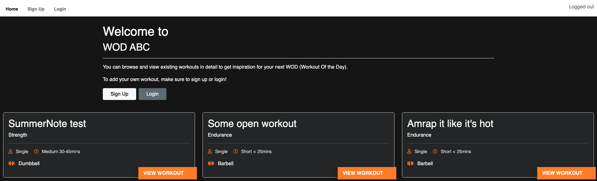
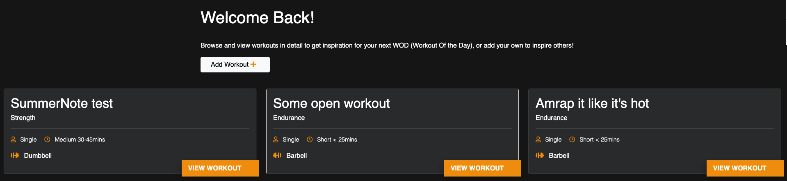
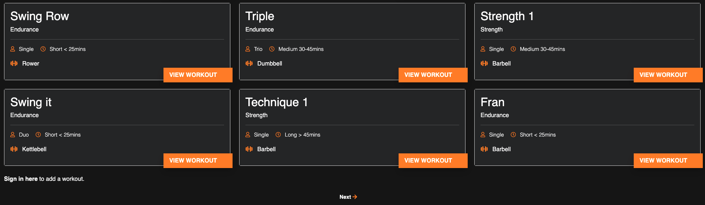
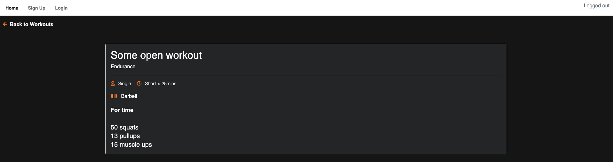
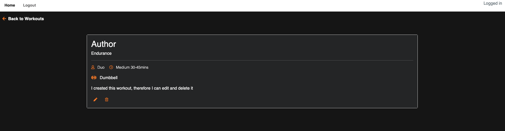

# ABC WOD

ACB WOD is a website for people who workout and need inspiration for their next workout (or Workout of the day - WOD). Any user can view workout, both exerpt and in detail, but only registered users can add workouts. Owners of workouts are also able to edit and delete their posts.

[Link to deployed site](https://wod-abc.herokuapp.com/)

## UX

### Imagery

My application doesn't feature any imagery as such, however it does make use of Font Awesome icons where needed to add a bit of visual enhancement.

### Typography

The font used for my website is "Murecho".

### Colour scheme

### Schema

Please see below an overview of the schema for my application:

The details of each schema is as follows:

### Wireframes

Wireframes were created with Balsamiq. The project was developed from the initial wireframes and some modifications were made during the development process for improved usability and user experience.

### User Stories:

Github issues were used to record the user stories. Stories were categorized into different priorities: “Must have”, “Should Have” and “Could Have”.

#### Site administrator:

- As a site admin I can manage site content so that admin remains in control of the site

#### New users:

- As a site user I can view summary content so that I can find inspiration
- As a site user I can register an account so that I can access the full features of the site
- As a site user I can login to the website so that I can use the site´s full functionalities
- As a logged in site user I can add new workouts so that I and other site users can view them
- As a logged in user I can view workout details so that all information is available to me
- As a logged in site user I can edit my workouts so that they can be updated as needed
- As a logged in site user I can delete my workouts so that they can be permanently removed if no longer needed
- As a logged in site user I can logout so that my account and contributions are protected
-As a logged in user, I can use a “What you see is what you get” for formatting text so that it visually displays as expected.

### Could haves (not implemented yet)
- As a logged in site user I can search and filter the content so that I can find a workout that suits my preferences
- As a logged in site user I can add workouts to a favorite´s list so that I can easily revisit them
- As a site user I can use social media to login so that I don't have to create a new account

### Agile Methodology

Github Issues were used to create User Stories and group them according to MoSCoW prioritization technique. GitHub Projects and Kanban board was used to visualize and execute the agile methodology. The issues are currently in two categories: “Done” and “For next release”.

## Features

### Existing Features

#### Navbar and footer
Navbar and footer are using Bootstrap components and are adjusted  to the needs of the project.

##### Home page

Home page consists of a Welcome Hero with a short message with buttons to Sign up/Login or Add Workout - depending on the user login status.

Second part of the home page is the list of workouts. The list is generated dynamically as per most current workouts first. The page paginated at 9 workouts and will at that point display Next /Prev buttons to navigate to next and previous pages.

#### Workout full

Clicking "View Workout" will take the user to the full Workout where the full contents is displayed.

If user is the author of the workout, edit and delete icons will display at the bottom if the workout card to allow user to edit workout or delete workout.

#### Add Workout / Edit

Add Workout displays a custom form where all fields are required. The content filed is a SummerNote WYSIWYG which allows user to custom the visual appearance of the content. Submitting a valid form will redirect user back to the homepage and the newly added workout is displayed first. A success message is displayed and automatically closed after 3,5 seconds.
If the user does not fill out the title field, the form will not submit and the title field is highlighted. If the user does to fill out any content, the form will reload blank and an error message is displayed and automatically closed after 3,5 seconds.

The Edit form is identical to the Add form, but is pre-populated with the current contents.

#### Delete Workout

If user us the author of a workout, a delete icon will be displayed when viewing the full workout. Clicking the delete icon prompts a Delete Modal, asking "Are you sure you want to delete this workout?". Chosing "Close" will close the modal without action. Chosing "Delete" will delete the workout permanently and display a message to the user that the Workout has been deleted. The message will be automatically closed after 3,5 seconds.

#### Signup / Login / Logout

Users can signup to gain access to all features (i.e. ability to add, edit and delete their own Workouts). Once an account is created, users can login and logout.

### Features Left to Implement

- Allow users to filter for category, length and number of participants
- Allow users to add favorite workouts to revisit later
- Allow user to login via social media

## Technologies Used

### Languages

- HTML - Required for the render templates
- CSS - Used to provide required custom styling for the templates
- JavaScript - Used to provide custom code to automatically dismiss messages
- Python - The language that the Django framework is based on

### Libraries

- Bootstrap - Used for various components in the templates as follows:
    - Navbar - For navigation element in header
    - Modal - Used for the post delete confirmation popup
    - Grid - To configure layout of page elements
    - CSS - Used for element styling
    - JavaScript - Used for automation of components

### Frameworks

- Django - Full stack framework used to build this application

### Platforms

- GitHub - Where code repository resides with Git version control
- Gitpod - IDE used for development with Git version control
- Heroku - Where the deployed application is served from
- Cloudinary - Where static files are stored for the deployed application

## Testing

### Bugs

### Validator testing

- HTML 

- CSS 

- Python 

## Deployment

### Initial deployment

- Gitpod
    - Create new repository from CI template
    - Install Django and required dependencies into Gitpod workspace
    - Create new Django project called "wodabc" and app called "wod"
    - Create Procfile as required
    - Run "pip3 freeze --local > requirements.txt" to update requirements file

- Heroku
    - Log into Heroku
    - Create new app called "wod-abc" (name has to be unique)
    - Go to Resources Tab, Add-ons, search and add Heroku PostgreSQL "hobby" database as resource.
    - Go to section "Config Vars" and click button "Reveal Config Vars"
    - Add the below variables to the list
        - Database URL will be added automaticaly
        - Secret_key - is the django secret key
        - Cloudinary URL can be obtained from [cloudinary](https://cloudinary.com/) follow the steps on the website to register.
        - Configure "DISABLE_COLLECTSTATIC = 1" in Config Vars

- Gitpod
    - Create env.py file and add database path from Heroku
    - Add secret key to env.py
    - Configure database path and secret key in settings.py to be read from environment variables
    - Add Heroku to ALLOWED_HOSTS in settings in your app
    - Perform commit and push to GitHub

- Heroku
    - Under the app app, browse to Deploy
    - Connect to Github, select appropriate repository
    - Run Deploy
    - Wait for confirmation that app has deployed

### Final deployment

- Gitpod
    - Ensure all required files up-to-date and that application is working
    - Run "pip3 freeze --local > requirements.txt" to update requirements file
    - Ensure "DEBUG = False" set in settings.py
    - Perform commit and push to GitHub
- Heroku
    - Under the app, browse to Config Vars
    - Remove the value "DISABLE_COLLECTSTATIC = 1" from Config Vars
    - Browse to Deploy and run deployment
    - Wait for confirmation that app has deployed

## Credits

Used to set up SummerNote in ModelForms https://djangocentral.com/integrating-summernote-in-django/

### Content

### Media

### Acknowledgements

